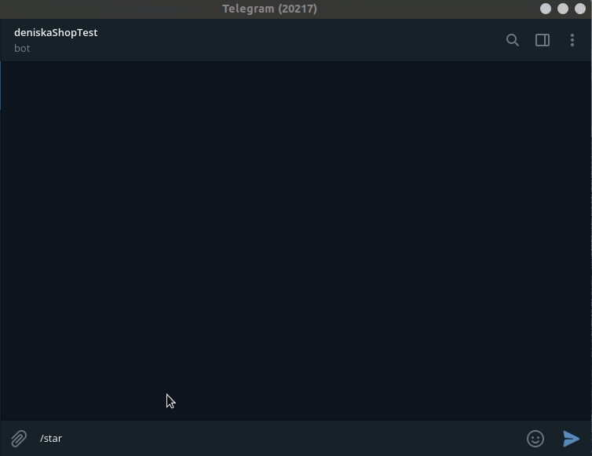

# FishShop bot

**FishShop bot** - это telegram чат-бот для торговли рыбой (и другими морепродуктами) с Камчатки.

## Пример бота
Доступен по ссылке в Телеграм: [Kamchatka 🐟 Store](https://t.me/fish_seller_bot)



## Запуск
- Рекомендуется использовать виртуальное окружение для запуска проекта
- Для корректной работы Вам необходим Python версии 3.6 и выше
- API-ключ для работы с Telegram-ботом (инструкция [тут](https://way23.ru/%D1%80%D0%B5%D0%B3%D0%B8%D1%81%D1%82%D1%80%D0%B0%D1%86%D0%B8%D1%8F-%D0%B1%D0%BE%D1%82%D0%B0-%D0%B2-telegram.html)).
- Учетная запись [Moltin](https://www.moltin.com/)
- Скачайте код (`git clone`)
- Установите зависимости командой
```bash
pip install -r requirements.txt
```
**Перед первым запуском необходимо:**
1. [x] Создать товары
2. [x] Создать каталог
3. [x] Создать иерархию
4. [x] Создать прайсбук
5. [x] В прайсбук добавить товары 
6. [x] В иерархии подцепить товары к категориям
7. [x] В каталоге указать иерархию с товарами
8. [x] В меню каталога, напротив каталога (справа 3 точки) - опубликовать каталог


- Для запуска Telegram-бота необходимо выполнить команду:
```bash
python tg_bot.py
```

## Переменные окружения

Часть настроек проекта берётся из переменных окружения. Чтобы их определить, 
создайте файл `.env` в корневой директории проекта и запишите туда данные в таком 
формате: `ПЕРЕМЕННАЯ="значение"`.

Доступные переменные:

- `TELEGRAM_TOKEN` - API-ключ для работы с Telegram-ботом
- `CLIENT_ID` - ID клиента для работы с CMS [инструкция тут](https://elasticpath.dev/docs/authentication/application-keys/application-keys-cm)
- `CLIENT_SECRET` - Секретный ключ для работы с CMS [инструкция тут](https://elasticpath.dev/docs/authentication/application-keys/application-keys-cm)

## Цели проекта

Код написан в учебных целях — это урок в курсе по Python и веб-разработке на сайте [Devman](https://dvmn.org).